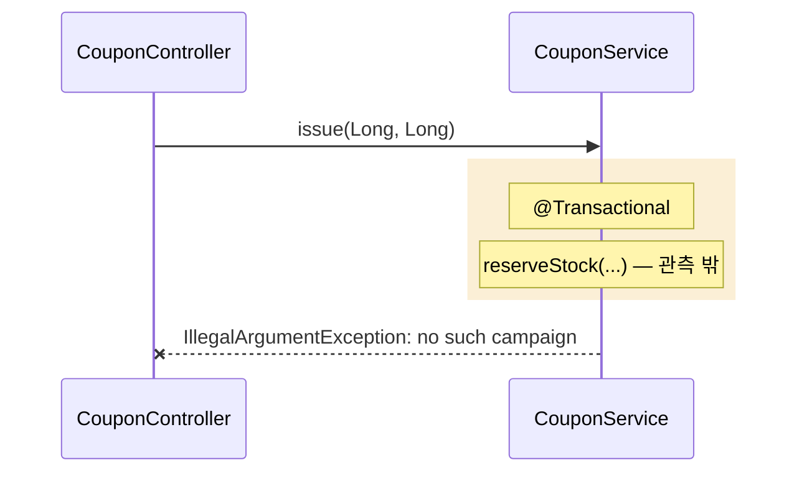

# 0002 — 시퀀스 렌즈 (트레이스 → 시퀀스 다이어그램 + Mermaid export)

- **상태**: 🚧 진행 — Phase 1 ✅ (인앱 시퀀스 뷰), Phase 2/3 대기
- **이슈**: [#10](https://github.com/yeseul-kim01/flowdoc/issues/10)
- **브랜치**: `feat/sequence-lens`
- **로드맵**: v0.3+ (0001 런타임 오버레이 위에 얹는 뷰). 기획안 §10 "트레이스 뷰"의 확장.
- **백로그**: ideas.md A 계열(그래프 렌즈) — 등급 ✅ **스펙 그대로**(스캐너 0수정, UI만).
- **브랜치**: `feat/sequence-lens` (미정)
- **담당**: UI는 공유 자산 → kys/jch 공동. 수집기 작업은 사실상 없음(이미 `traces[]` 산출).
- **선행 의존**: [[0001-runtime-trace-overlay]] (런타임 트레이스가 있어야 의미 있음)

## 무엇을 / 왜

**한 스펙, 두 렌즈**로 간다. 지금 FlowDoc의 구조 뷰는 **콜 트리(Call Hierarchy)** 성격 — "이 엔드포인트가
무엇을 건드리나 / 영향 범위"에 강하다. 여기에 **시퀀스 렌즈**를 더한다 — "실제로 누가 누구를 어떤
순서로 불렀나".

**왜 시퀀스인가 (현업 근거).** 백엔드 내부 협업에서 "내부 플로우"를 그릴 때 표준은 **시퀀스 다이어그램**이다.
플로우차트는 클라이언트/PM 소통·비즈니스 분기용이고, 내부에선 거의 안 쓴다. 팀들은 보통 **Mermaid/PlantUML
시퀀스**를 PR·README·Confluence에 붙여 소통한다 (GitHub이 Mermaid를 렌더하므로 사실상 공용어).

**핵심 빈틈.** 그 시퀀스 다이어그램은 대부분 **손으로 그려서 코드와 금방 어긋난다.** 그래서 현업은
다이어그램을 안 믿고 코드/트레이싱을 본다. 반대로 분산 트레이싱은 "진짜 순서"를 주지만 운영용이라 무겁고
코드 읽는 화면과 떨어져 있다.

**FlowDoc의 한 수.** 우리가 0001에서 만든 **런타임 트레이스는 사실상 시퀀스 다이어그램 데이터 그 자체**다 —
`spans`는 순서(`tEnter`)·부모(`parent`)·참가자(`nodeId`의 owner)·스레드(`thread`)를 이미 갖고 있다.
이걸 시퀀스로 렌더하면:
- **실행에서 자동 생성** → 손그림과 달리 안 어긋남
- **Mermaid로 export** → 팀이 이미 사는 곳(PR/Confluence)에 그대로 붙임
- 구조 렌즈와 **같은 노드 ID**를 공유 → 두 뷰가 한 진실을 다르게 비출 뿐

> 차별점 한 줄: "**실행으로 검증된, 항상 최신인 시퀀스 다이어그램** — 코드 옆에서, 손그림 없이."

## 스펙 영향

**없음 (✅ 스펙 그대로).** `Trace`/`Span`이 이미 순서·부모·참가자·스레드를 담는다. 시퀀스 렌즈는
기존 `traces[]`를 **다르게 읽는 UI**일 뿐 — 스캐너·스키마 무수정.

- Mermaid export 텍스트는 파생 산출물(스펙 아님).
- (선택) 트레이스가 없을 때 **정적 근사 시퀀스**를 그리고 싶으면 `edges[].site.line`(호출 위치 줄번호)로
  메서드 본문 내 호출 순서를 근사할 수 있다. 이것도 기존 필드라 스펙 변경 없음. 단, 정적은 실제 실행 순서·
  분기·async를 보장 못 하므로 **"정적 추정 순서"로 명확히 라벨**한다. (정확한 순서는 런타임 트레이스가 진실)

## 아키텍처 + 기술 난제

기존 트레이스 선택 UI(0001의 사이드바)를 재사용. 트레이스 하나를 고르면 콜 트리 대신/옆에 시퀀스로 렌더.

**렌더 매핑 (trace → sequence)**
- **참가자(lifeline)** = 트레이스에 등장한 distinct owner(클래스/빈), **최초 등장 순서**로 배치.
- **메시지** = `spans`를 `tEnter` 순으로, `parent` span의 owner → 해당 span의 owner 화살표, 라벨은 메서드명.
- **활성 구간(activation bar)** = `tEnter`→`tExit`.
- **리턴 화살표** = `tExit` 시 점선(옵션, 토글).
- **실패** = `errorSpanId` 프레임에서 끊고 `--x` (예외) + 메시지(`error`)로 표시.

**진짜 난제 (= 정직성·가독성)**
1. **"관측 밖"은 메시지가 없다.** repository·external·self-invocation은 span이 없어서 화살표로 못 그린다.
   오버레이의 3상태 정직성을 시퀀스에서도 유지 — 해당 호출은 **생략하거나 점선 Note("관측 밖")**로,
   "여기서 더 깊은 호출이 있었지만 AOP가 못 봄"을 명시. 거짓 화살표를 만들지 않는다.
2. **self-invocation은 시퀀스에서 자기 메시지(A→A)인데 span이 없음.** 그래서 안 그려짐 = AOP 가시성과
   일치. 트리 뷰에서 "관측 밖"으로 이미 보이므로 시퀀스에선 생략이 정직.
3. **이름이 길다.** `com.example.coupon.service.CouponService` → 참가자 alias(`S as CouponService`)로 축약.
   FQN 충돌 시 패키지 일부 포함.
4. **재귀/대량 span.** 같은 참가자 반복·깊은 트레이스는 Mermaid가 장황해짐 → 깊이 제한·접기, span 수
   상한 + "N개 생략" 표기(silent truncation 금지).
5. **async/멀티스레드(0001 Phase 2 이후).** 다른 `thread`의 span = async 메시지(Mermaid `-)`)로,
   별도 lifeline. tx 커밋 후 후처리는 tx 박스 밖.
6. **tx 경계.** `@Transactional` 구간을 Mermaid `rect`/`Note over`로 감싸 "이 안이 한 트랜잭션"을 표시.
7. **Mermaid 텍스트 생성·escape.** 라벨의 특수문자(`<>`, `:`, 줄바꿈) escape, 참가자 id 안전화.
   export는 **클립보드 복사 + `.mmd`/`.md` 다운로드** 두 경로.

**예시 (coupon issue, 에러 경로)**

> `reserveStock`/`findById`는 관측 밖이라 실선 메시지로 안 그리고 Note로만 정직하게 표기.

## 단계 분할

- **Phase 1 — 인앱 시퀀스 뷰 ✅:** 선택한 트레이스를 SVG 시퀀스로 렌더 — 참가자(요청 actor + span owner,
  최초 등장 순), 메시지(`tEnter` 순 call/return), activation bar, 실패 `✕`(에러 경로 span + 예외 메시지).
  seq-head에 **콜 트리 ↔ 시퀀스 토글**(트레이스 선택 시에만). 관측 밖(repo·external·self)은 `adjacency`로
  찾아 **회색 Note로 정직 표기**(실선 화살표 날조 안 함). async span은 다른 `thread`면 **점선 화살표**(0001
  Phase 2 스티칭 머지되면 실선 async 메시지로 표시). **`ui/`만, 스펙·스캐너 0수정.** node `--check` +
  stub 로직테스트(참가자/async/Note/에러 `--x`)로 검증, 라이브 `/flowdoc` 서빙 확인.
- **Phase 2 — Mermaid export:** `sequenceDiagram` 텍스트 생성 + 복사/다운로드. GitHub PR·Confluence에
  붙여 렌더 확인. 참가자 alias·escape·truncation 처리.
- **Phase 3 — 리치 표현:** tx 박스, async 병렬 lifeline(0001 Phase 2 스레드홉 의존), 리턴 화살표 토글.
- **(선택) 정적 근사 시퀀스:** 트레이스가 없을 때 `edges[].site.line`로 호출 순서 근사, "정적 추정"으로 라벨.

## 패리티 (Spring ↔ FastAPI)

**수집기 작업 거의 없음.** 시퀀스 렌즈는 **공유 UI가 `traces[]`를 다르게 읽는 것**뿐이라, 양쪽이 이미
트레이스를 산출하면(0001 / 그 패리티 #7) 자동으로 둘 다 적용된다. 언어 중립.

- 별도 parity 이슈는 사실상 불필요 — UI는 공유 자산이고 스펙 변경이 없음. 다만 **0001(FastAPI 런타임)이
  선행**돼야 Python 트레이스가 시퀀스로도 뜬다.
- (선택) 정적 근사 시퀀스를 넣는다면 `edges[].site.line`을 양쪽 스캐너가 동일하게 채우는지만 확인.
- 공유 UI 변경이므로 PR은 **양측 리뷰**(collaboration.md).

## 완료 기준

- 선택한 트레이스가 시퀀스 다이어그램으로 렌더된다 (참가자=빈, 메시지=**관측된** 호출 순서, activation, 실패 표시).
- **관측 밖/3상태 정직성 유지** — 없는 호출을 실선으로 날조하지 않는다.
- **Mermaid export**가 GitHub/Confluence에서 그대로 렌더된다.
- 같은 `ui/index.html`에서 **Java·Python 트레이스 모두** 동일하게 시퀀스로 보인다.
